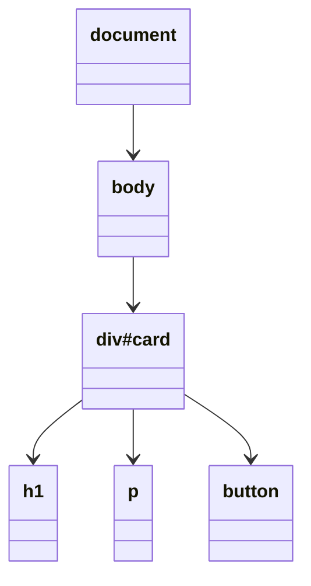
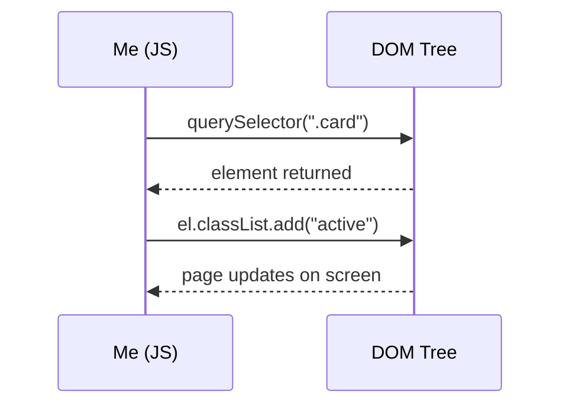

# Day 6 – JavaScript & the DOM 🧠

selecting · traversing · changing · events

Today was the day a page stopped being just a static poster and started actually responding to people.

---

## What is JavaScript

HTML builds the structure, CSS makes it look good, and JS is what gives it behaviour — makes it actually *do* things when someone interacts with it. Three completely separate jobs, and mixing them up (like writing styles inside JS) is exactly what today's notes kept warning against.

---

## What is the DOM

**DOM = Document Object Model.** When the browser loads HTML, it turns it into a tree — every single tag becomes a node that JS can reach and change.



The part that actually clicked today: **the DOM isn't part of JavaScript itself.** It's the browser's own API — the browser builds this tree, and then hands over methods like `querySelector` and `appendChild` so JS can work with it. Without a browser, none of this tree stuff would exist at all.

---

## Nodes = a family tree

Every node has a **parent**, **children**, and **siblings**, exactly like a family. In the diagram above, `div#card` is the parent of `h1`, `p`, and `button` — and those three are siblings of each other since they sit at the same level.

---

## Selecting elements

Before anything can be changed, it first has to be found:

```js
document.getElementById("card")
document.getElementsByClassName("card")
document.getElementsByTagName("li")
document.querySelector(".card")
document.querySelectorAll(".card")
```

`getElementById`, `getElementsByClassName`, and `getElementsByTagName` are the older methods — they still work but barely anyone reaches for them now. `querySelector` and `querySelectorAll` are the ones worth remembering, mainly because they use the exact same selectors already learned in CSS. Nothing new to memorise, just reused knowledge.

---

## CSS selectors that also work here

| selector | meaning |
|---|---|
| `#id` | grab by id |
| `.class` | grab by class |
| `tag` | grab by tag name |
| `.a.b` | must have both classes |
| `A B` | any B inside A, no matter how deep |
| `A > B` | a direct child of A only |
| `A + B` | the element right after A |
| `:first-child` / `:last-child` | first / last child inside its parent |
| `:nth-child(even/odd)` | picks alternating elements, useful for striping table rows |
| `:not(x)` | everything except elements matching x |
| `[attr="x"]` | element where an attribute equals a specific value |

---

## Traversing the tree

Once an element is already selected, sometimes what's actually needed is something *near* it:

- `el.parentElement` → moves up
- `el.children` → everything directly below
- `el.firstElementChild` / `el.lastElementChild`
- `el.nextElementSibling` / `el.previousElementSibling`
- `el.closest(".card")` → keeps walking up through parents until something matches
- `card.querySelector("button")` → unlike the global `document.querySelector`, this only looks inside `card`

**the interview point that stuck:** working with the DOM really only has 2 jobs — first **FIND** something, then **move / read / change** it. Everything from today fits inside those two steps.



---

## Reading & changing an element

**Text and html:**
```js
button.textContent = "Submit";
div.innerHTML = "<h1>Hi</h1>";
```
`textContent` is safer for plain text. `innerHTML` can insert actual tags, but needs a little more care since it can also run unwanted html if not handled properly.

**Style directly (best avoided when possible):**
```js
button.style.color = "red";
```

**Classes — the better way to change how something looks:**
```js
el.classList.add("active");
el.classList.remove("active");
el.classList.toggle("active");
el.classList.contains("active");
```
This one connects straight back to the hamburger menu on the ResumeFlow landing page — that's exactly what `classList.toggle` is for, switching something on and off cleanly instead of writing style lines one by one.

**Attributes:**
```js
img.setAttribute("src", "dog.png");
img.getAttribute("src");
img.removeAttribute("alt");
```

**Data attributes and form values:**
```js
el.dataset.userId;
input.value;
```

---

## Creating, adding & removing

```js
const li = document.createElement("li");
li.textContent = "Apple";

ul.appendChild(li);
ul.prepend(li);
node.before(li);
node.after(li);
ul.insertAdjacentHTML("beforeend", "<li>Hi</li>");

li.cloneNode(true);
old.replaceWith(li);
button.remove();
```

`createElement` only builds the element in memory — it won't show up on the page until it's actually attached somewhere with `appendChild`, `prepend`, `before`, or `after`.

---

## HTMLCollection vs NodeList

This one genuinely confused me for a bit.

- `.children` gives back an **HTMLCollection** — it's *live*, meaning if the DOM changes later, this list updates itself automatically.
- `querySelectorAll()` gives back a **NodeList** — it's *static*, more like a snapshot frozen at that exact moment. It has to be looped through with `forEach()`.

quick way I'm keeping this straight: `.children` = live, updates on its own. `querySelectorAll` = frozen picture, stays exactly as it was.

---

## Cheat sheet — the whole DOM API in one place

| method | what it does |
|---|---|
| `getElementById()` | find by id |
| `getElementsByClassName / TagName()` | find by class / tag (older) |
| `querySelector() / querySelectorAll()` | find by CSS selector (modern) |
| `parentElement / children` | move up / down |
| `first / lastElementChild` | first / last child |
| `next / prevElementSibling` | the neighbours |
| `closest()` | nearest matching ancestor |
| `textContent / innerText / innerHTML` | read / change content |
| `style` | change inline CSS |
| `classList.add/remove/toggle/contains` | manage classes |
| `get / set / removeAttribute()` | manage attributes |
| `dataset / value` | data-* attrs / form value |
| `createElement()` | make a new element |
| `appendChild / prepend / before / after` | add to the page |
| `insertAdjacentHTML()` | quick html insert |
| `cloneNode() / replaceWith() / remove()` | copy / replace / delete |

---

## Closing note

The biggest shift today was realising the DOM isn't some separate thing to memorise — it's just the browser handing JS a map of the page, and giving it the tools to walk around and rearrange it. Once that clicked, all the methods stopped feeling random and started feeling like they belong to two simple buckets: find it, then do something with it.
