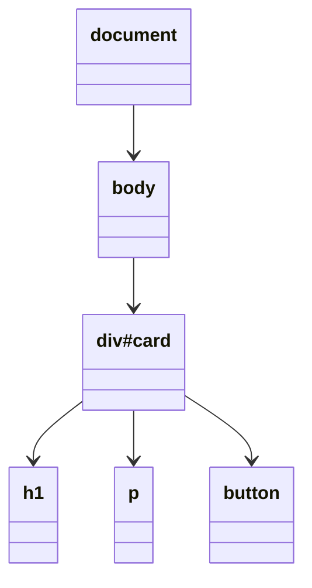
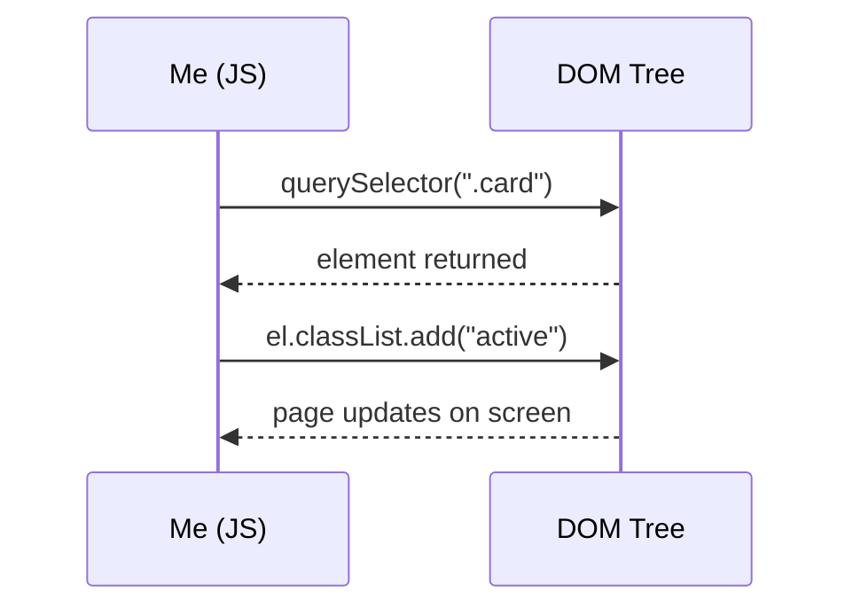

# Day 6 – JS & the DOM 🧠

selecting → traversing → changing → events

Today was a good one — finally clicked that a page isn't just a "poster", JS can actually make it interactive.

---

## What DOM actually is

Simple def: **DOM = Document Object Model**. When the browser reads HTML, it turns it into a tree — every tag becomes a "node". And JS can touch that tree, change it.

The most confusing part that finally clicked today: **the DOM is not part of JavaScript itself**. It's given separately by the browser as an API. So there's no `querySelector` sitting inside the JS language — the browser is the one handing us that method. If there was no browser, this whole tree thing wouldn't even exist.



So in the picture above, `document` is the top of everything. Inside it is `body`, inside that is a `div#card`, and inside that div there are three elements — `h1`, `p`, `button`. Every single one of these is called a **node**.

A node has three relationships, just like a family:
- a **parent** (the one directly above it)
- **children** (the ones directly below it)
- **siblings** (the ones on the same level, next to it)

For example, in the picture: `div#card` is the parent of `h1`, `p`, and `button`. And `h1`, `p`, `button` are siblings of each other, because they're all at the same level.

**to remember:** HTML = skeleton (structure), CSS = look (clothes), JS = behaviour (brain). All three do separate jobs and shouldn't be mixed — especially don't write styles from inside JS, that job belongs to CSS.

---

## How to select an element

Before I can change anything on the page, I first have to grab hold of it. That's what "selecting" means. The browser gives a few different methods for this:

```js
document.getElementById("card")         // finds one element by its id
document.getElementsByClassName("card") // finds all elements with this class
document.getElementsByTagName("li")     // finds all elements with this tag
document.querySelector(".card")         // finds the first element matching a CSS selector
document.querySelectorAll(".card")      // finds every element matching a CSS selector
```

Out of all these, `getElementById`, `getElementsByClassName`, and `getElementsByTagName` are the older methods. They still work, but barely anyone reaches for them anymore.

The one actually worth remembering is `querySelector` (for one element) and `querySelectorAll` (for many elements). The reason they're so useful is that they accept the exact same selectors already used in CSS — so there's basically nothing new to memorise here, it's the same knowledge reused in JS.

---

## CSS selectors that also work inside querySelector

Since `querySelector` uses CSS selectors, this table is basically a CSS revision too.

| selector | meaning |
|---|---|
| `#id` | grab the element with this id |
| `.class` | grab elements with this class |
| `tag` | grab elements with this tag name |
| `.a.b` | element must have both classes at once |
| `A B` | any B that is inside A, no matter how deep |
| `A > B` | only a B that is a direct child of A |
| `A + B` | the element right after A |
| `:first-child` / `:last-child` | the first / last child inside its parent |
| `:nth-child(even/odd)` | picks alternate elements — used a lot for striping table rows |
| `:not(x)` | everything except elements matching x |
| `[attr="x"]` | element where an attribute equals a specific value |

(there were a few more selectors in the original notes, but these are the ones I'll actually reach for the most, so keeping this list short and useful)

---

## Moving around the tree (traversing)

Once an element is already selected, sometimes I don't want that exact element — I want something near it, like its parent or its neighbour. That's called **traversing**, and these are the ways to move around:

- `el.parentElement` → moves up to the parent
- `el.children` → gives everything that is directly below this element
- `el.firstElementChild` / `el.lastElementChild` → the first or last child only
- `el.nextElementSibling` / `el.previousElementSibling` → the element right after / right before, at the same level
- `el.closest(".card")` → keeps walking upward through parents until it finds something matching `.card`
- `card.querySelector("button")` → this is different from the global `document.querySelector` — this one only looks *inside* `card`, ignoring the rest of the page

**interview point Dinesh sir mentioned:** working with the DOM really only has 2 jobs — first you **FIND** an element, and then you **move / read / change** it. That's the whole idea. Everything in today's class fits inside these two steps.



This diagram shows exactly that flow — first I ask the DOM to find something, it hands me back the element, then I tell it to change something about that element, and the page updates live on screen.

---

## Reading and changing an element

Once an element is in hand, here's what can actually be done to it.

**Changing text or html inside it:**
```js
button.textContent = "Submit";   // changes plain text
div.innerHTML = "<h1>Hi</h1>";    // inserts actual html tags
```
`textContent` only deals with plain text — safer to use. `innerHTML` can insert real tags, but should be used carefully since it can also run unwanted html if not careful.

**Changing style directly (should be avoided when possible):**
```js
button.style.color = "red";
```
Writing styles directly from JS works, but it's not the best habit — CSS should be the one deciding how things look.

**Managing classes (this is the better way to change how something looks):**
```js
el.classList.add("active");
el.classList.remove("active");
el.classList.toggle("active");     // turns it on if off, off if on
el.classList.contains("active");   // checks true/false if class is present
```

**Managing attributes:**
```js
img.setAttribute("src", "dog.png");  // sets an attribute
img.getAttribute("src");              // reads an attribute
```

**Custom data attributes and form values:**
```js
el.dataset.userId;   // reads a data-user-id="..." attribute
input.value;          // reads/sets what's typed in an input box
```

**Note to self:** use `classList.toggle` whenever something needs to switch on/off, like the hamburger menu — it's much cleaner than writing style lines one by one. And for plain text, always prefer `textContent` over `innerHTML`, unless actual html tags need to be inserted.

---

## Creating, adding, and removing elements

Sometimes an element doesn't exist yet on the page and needs to be built from scratch, then placed somewhere.

```js
const li = document.createElement("li");  // creates a new <li>, not yet on the page
li.textContent = "Apple";                  // give it some text

ul.appendChild(li);   // adds it as the last child inside ul
ul.prepend(li);        // adds it as the first child inside ul
node.before(li);        // places it right before node
node.after(li);          // places it right after node

button.remove();   // removes button from the page completely
```

The important thing to remember here: `createElement` only builds the element in memory — it doesn't show up on the page until it's actually attached somewhere using `appendChild`, `prepend`, `before`, or `after`.

---

## HTMLCollection vs NodeList — this used to confuse me

This is one of those things that sounds small but actually matters.

- Whatever `.children` gives back is an **HTMLCollection**. This is *live* — meaning if the DOM changes later (say a new element gets added), this collection automatically updates itself too, without needing to run the selector again.
- Whatever `querySelectorAll()` gives back is a **NodeList**. This is *static* — more like a screenshot at the moment it was taken. If the DOM changes after that, this list stays exactly the same. It needs to be looped through using `forEach()`.

**quick way to remember it:** `.children` = live, updates on its own. `querySelectorAll` = frozen picture, stays as it was.

---

## Full cheat sheet (for quick revision before viva)

| method | what it does |
|---|---|
| `getElementById()` | find one element by id |
| `querySelector()` / `querySelectorAll()` | modern way to find, first match / all matches |
| `parentElement` / `children` | move up / move down the tree |
| `nextElementSibling` / `previousElementSibling` | move to the neighbour element |
| `closest()` | walk upward until a matching ancestor is found |
| `textContent` / `innerHTML` | read or change what's inside an element |
| `classList.add/remove/toggle/contains` | manage classes on an element |
| `setAttribute` / `getAttribute` / `removeAttribute` | manage attributes on an element |
| `createElement()` | build a brand new node |
| `appendChild` / `prepend` / `before` / `after` | attach a node onto the page |
| `remove()` | take an element off the page |

---

## Doubts / need to practice

- what's the real difference between `closest()` and a normal `querySelector()` in practice — try building a small example to actually see it
- why is `HTMLCollection` live but `NodeList` isn't — need to understand this a bit deeper, not just memorise it
- try out all 4 positions of `insertAdjacentHTML` (`beforebegin`, `afterbegin`, `beforeend`, `afterend`) hands-on
